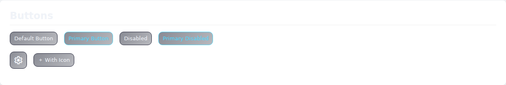
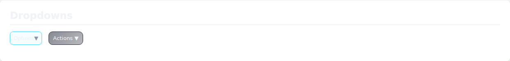
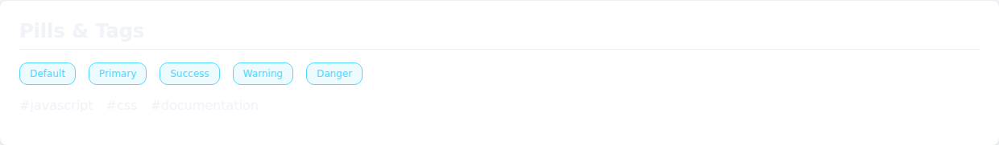
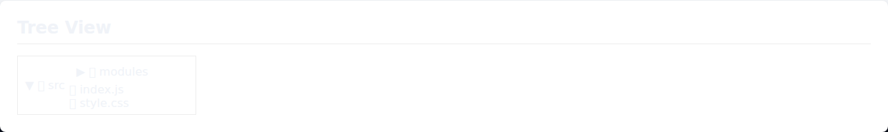
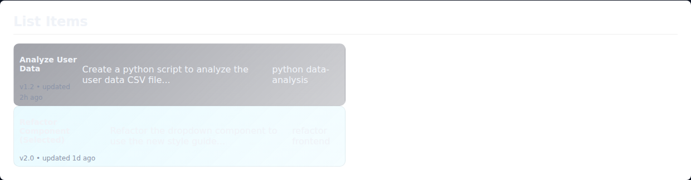
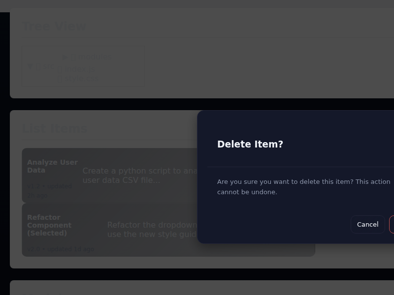
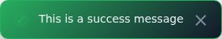
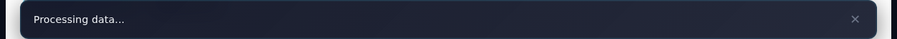

# Component Examples & Edge Cases

This guide provides a reference for the core UI components used in PromptRoot, including their structure, usage, and known edge cases.

## Table of Contents

- [Buttons](#buttons)
- [Dropdowns](#dropdowns)
- [Pills & Tags](#pills--tags)
- [Tree View](#tree-view)
- [List Items](#list-items)
- [Modals](#modals)
- [Toasts](#toasts)
- [Status Bar](#status-bar)
- [Troubleshooting](#troubleshooting)

---

## Buttons

Buttons are styled using `src/styles/components/buttons.css`. They support various states and variants.



### HTML Structure

```html
<!-- Default -->
<button class="btn">Default Button</button>

<!-- Primary -->
<button class="btn primary">Primary Button</button>

<!-- Disabled -->
<button class="btn" disabled>Disabled</button>

<!-- Icon Button -->
<button class="btn-icon" title="Settings"><span class="material-symbols-outlined">settings</span></button>

<!-- Button with Icon -->
<button class="btn"><span class="icon icon-inline" aria-hidden="true">add</span> With Icon</button>
```

### Edge Cases
- **Long Text**: Buttons will expand horizontally. Use `text-overflow: ellipsis` if fixed width is required (custom utility needed).
- **Icons**: Ensure `icon-inline` class is used for alignment when combined with text.

---

## Dropdowns

Dropdowns are managed by `src/modules/dropdown.js` and styled in `src/styles/components/dropdown.css`.




### Usage

```javascript
import { initDropdown } from './src/modules/dropdown.js';

const btn = document.querySelector('.custom-dropdown-btn');
const menu = document.querySelector('.custom-dropdown-menu');

initDropdown(btn, menu);
```

### HTML Structure

```html
<div class="custom-dropdown">
  <button class="custom-dropdown-btn" type="button">
    <span>Options</span>
    <span class="custom-dropdown-caret" aria-hidden="true">▼</span>
  </button>
  <div class="custom-dropdown-menu" role="menu">
    <div class="custom-dropdown-item" role="menuitem">Profile</div>
    <div class="custom-dropdown-item" role="menuitem">Settings</div>
    <div class="custom-dropdown-divider"></div>
    <div class="custom-dropdown-item" role="menuitem">Logout</div>
  </div>
</div>
```

### Edge Cases
- **Nested Dropdowns**: Not natively supported. Avoid placing a dropdown inside another dropdown menu.
- **Overflow**: If placed near the edge of the screen, the menu might be clipped. The current implementation does not automatically reposition (e.g., flip up). Ensure sufficient space or custom positioning logic.
- **Z-Index**: `custom-dropdown-menu` uses `z-index: 100`. Ensure it's higher than adjacent content but lower than modals (`z-index: 10000`).

---

## Pills & Tags

Pills and tags are used for labels, status indicators, and categories.



### Files
- `src/styles/components/pills.css`
- `src/styles/components/tags.css`

### HTML Structure

```html
<!-- Pills -->
<span class="pill pill-default">Default</span>
<span class="pill pill-primary">Primary</span>
<span class="pill pill-success">Success</span>
<span class="pill pill-warning">Warning</span>
<span class="pill pill-danger">Danger</span>

<!-- Tags -->
<span class="tag">#javascript</span>
```

---

## Tree View

Used for the file explorer sidebar. Styled in `src/styles/components/tree.css`.



### HTML Structure

```html
<div class="tree-root">
  <div class="tree-dir expanded">
    <div class="tree-dir-header">
      <span class="tree-arrow">▼</span>
      <span class="tree-icon">📂</span>
      <span class="tree-label">src</span>
    </div>
    <div class="tree-child-list" style="display:block;">
      <div class="tree-file selected">
        <span class="tree-icon">📄</span>
        <span class="tree-label">style.css</span>
      </div>
    </div>
  </div>
</div>
```

### Edge Cases
- **Deep Nesting**: Indentation is handled via padding/margins. Extremely deep nesting (10+ levels) might cause horizontal overflow.
- **Long Filenames**: Should truncate with ellipsis to prevent layout breaking.

---

## List Items

Used for the main prompt list. Styled in `src/styles/components/list.css`.



### HTML Structure

```html
<article class="item" tabindex="0">
  <div class="item-header">
    <h3 class="item-title">Title</h3>
    <span class="item-meta">v1.0 • updated 2h ago</span>
  </div>
  <div class="item-preview">Preview text...</div>
  <div class="item-tags">
    <span class="tag">tag1</span>
  </div>
</article>
```

---

## Modals

Modals are overlays for critical interactions. `src/modules/confirm-modal.js` provides a programmatic way to show confirmation dialogs.



### Usage

```javascript
import { showConfirm } from './src/modules/confirm-modal.js';

const confirmed = await showConfirm('Are you sure?', {
  title: 'Delete Item',
  confirmText: 'Delete',
  confirmStyle: 'danger'
});

if (confirmed) {
  // proceed
}
```

### Edge Cases
- **Modal inside Modal**: Stacking contexts are managed via z-index. The confirmation modal (`z-index: 10000`) sits above standard modals (`z-index: 1000`).
- **Scrollable Content**: Modals with long content should have `overflow-y: auto` on `.modal-content` or `.modal-body`.

---

## Toasts

Non-blocking notifications. Managed by `src/modules/toast.js`.



### Usage

```javascript
import { showToast } from './src/modules/toast.js';

showToast('Saved successfully', 'success');
// types: success, error, warn, info
```

### Edge Cases
- **Rapid Fire**: Multiple toasts stack vertically.
- **Long Message**: Text wraps automatically.

---

## Status Bar

Global status indicator at the bottom of the screen. Managed by `src/modules/status-bar.js`.



### Usage

```javascript
import statusBar from './src/modules/status-bar.js';

statusBar.showMessage('Processing...', { timeout: 0 }); // 0 = indefinite
statusBar.setProgress('50%', 50);
statusBar.hide();
```

---

## Troubleshooting

### Common Issues

1.  **Dropdown not opening**:
    -   Check if `initDropdown` was called for the element.
    -   Verify `src/styles/components/dropdown.css` is loaded.
    -   Check z-index if it's hidden behind other elements.

2.  **Modal overlay issue**:
    -   If the modal appears behind the backdrop or other content, check `z-index` stacking contexts. Move the modal element to `document.body` if necessary (handled automatically by `confirm-modal.js`).

3.  **Icons missing**:
    -   Ensure `src/font-init.js` is included in the head.
    -   Ensure `Material Symbols Outlined` font is loaded.

4.  **Styles not applying**:
    -   Check for specificity issues. The project uses some utility classes (`.hidden`, `.pad-lg`) that might conflict if not used carefully.
    -   Ensure component CSS files are imported in `src/styles.css`.
